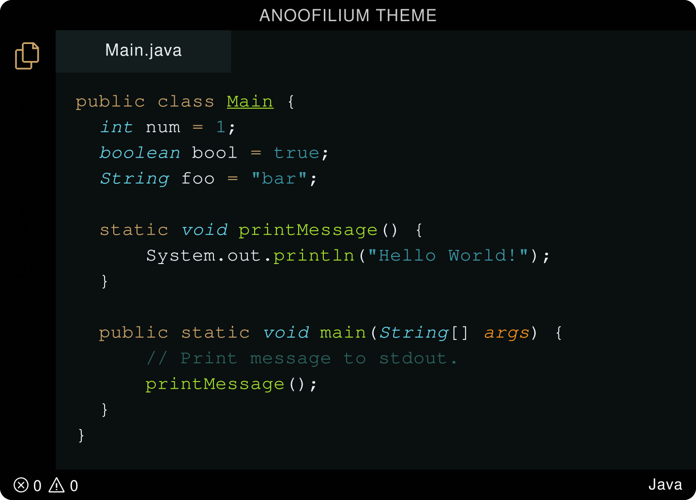

<link rel="preconnect" href="https://fonts.googleapis.com">
<link rel="preconnect" href="https://fonts.gstatic.com" crossorigin>
<link href="https://fonts.googleapis.com/css2?family=Saira+Stencil+One&display=swap" rel="stylesheet">

Howdy,

Welcome to the **Anoofilium Theme Extension**! This extension enhances your codespace with a beautiful theme, allowing you to personalize your user experience.

**_Figure Source:_** [VSCode Themes](https://vscodethemes.com/e/anoofilium.anoofilium-theme/anoofilium-theme?language=java)

## Installation

To install the Anoofilium Theme Extension, follow these simple steps:

1. Launch Visual Studio Code.
1. Open the Extensions view by clicking on the Extensions icon in the Activity Bar on the side of the window.
1. Search for "Anoofilium Theme" in the Extensions view search box.
1. Click on the "Install" button next to the "ANOOFILIUM THEME" entry.

Alternatively, you can install the extension from the Visual Studio Code Marketplace.

## Feedback and Support

We value your feedback and strive to improve the Anoofilium Theme Extension continuously. If you encounter any issues, or need assistance, please don't hesitate to reach out.

- **[Email](mailTo:anuabdulkadar@gmail.com)**
- **[LinkedIn](https://www.linkedin.com/in/anoof-abdul-kadar-883433147/)**

### **_Enjoy_**

Made with Love, 
[ANOOFILIUM](https://github.com/ANU1o)
